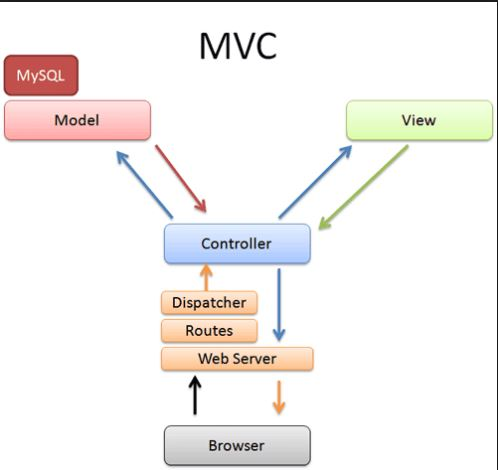
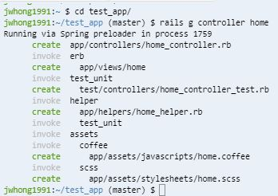
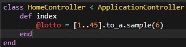
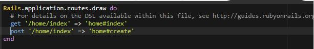
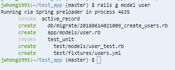
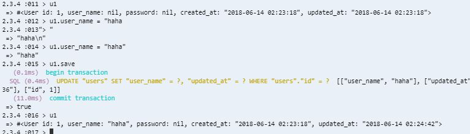

##  RAILS
### 1. 기본 설치
    * C9에서 사용하기 위해 cd ..로 최상위로 이동한다.
    * 설치
        - gem install rails -v 5.0.6 : rails 5.0.6버젼 설치
        - rvm install 2.4.1 : version manager를 이용해 ruby 2.4.1설치
        - rvm default 2.4.1 로 기본 버젼 지정 가능
        - rails _5.0.6_ new test_app : 프로젝트 생성(test_app이름으로)
    * 서버 동작시
        - 우상단의 Run Project는 workspace를 기반으로 되어 있음
        - rails s -b $PORT -o $IP : 실행
### 2. 기본
    * gem
        - ruby가 사용하는 library
    * bundler : 설치 --> gem install bundler
        - 내 프로젝트에 사용될 모든 gem을 자동으로 설치함
        - 해당 gem은 Gemfile에 명시한다.
        - Gemfile에 사용할 gem을 명시한 이후 터미널에 다음 명령어 입력
            >> bundle install 
            >> 해당 명령어는 사용할 라이브러리를 추가한 이후에도 반드시 해당 명령어를 실행
            >> 사용할 gem을 지우더라도 해당 명령어를 다시 수행해야 한다. 그래야 삭제됨
    * rails 파일
        - 실행되는 것이 모두 분리되어 있음.
        - test_app/app
            >> models, views, controllers
        - config/routes.rb : action에 따른 어떤 logic을 수행할지 명시함
            >> 클라이언트의 요청이 들어오면 어떤 controller의 action을 수행할지 지정함.
            >> 아래와 같이 설정이 된다.
                --> class __controller
                        def action_name
                        end
                    end
        - db/ : ORM이용해 db 설정
        - log : 로그파일. 각종 로그가 저장됨
        - public : 외부에서 모두가 접근가능한 폴더
        - test : rails의 프레임워크는 TDD(Test Driven Development)에 최적화되어 있음. 즉, test에 어떤 기능을 구현할지 명시할 수 있다.
        - tmp : 임시파일 저장
        - vendor : template 지정
        - Gemfile : gem관리
        - Gemfile.lock : 설치된 dependencies 확인
    * rails client - server 요청 관계
        - 하단 이미지 확인
            >> Routes는 config/routes.rb
            >> DBMS --> db/
    * cf)ORM
        - ORM : db에 만들 table의 column등의 설정진행
        - ORM : Object Relational Mapping : 객체와 관계형 DBMS간의 매핑을 지원해주는 Framework
    * rails mode
        - Development
            >> 변경사항이 자동적으로 확인되고, 모든 로그가 찍힌다.
        - Test
        - Production
            >> 변경사항이 자동적으로 저장되지 않음. 로그도 일부만 찍힌다.(낮은 level). `$ rails s`로 서버를 실행하지 않는다.

### 3. MVC
    * Controller
        - 역할?
            >> 서비스 로직을 가짐.
            >> 모델과 뷰를 연결해준다.
        - 규칙
            >> 모델, 뷰에 대해 알고 있어야 한다. 모델과 뷰는 서로에 대해서 알 수 없다.
            >> 모델, 뷰의 변경에 대해 인지하고 있어야 한다.
        - app.rb에서 작성한 모든 내용이 `Controller`에 들어간다.
        - `Controller`는 하나의 서비스에 대해서만 작성함.
        - `Controller`를 만들 때에는 `$ rails g controller 컨트롤러명` 을 이용한다.
            >> ex) 아래 스샷 참조
                `$rails g controller home`
                `# app/controllers/home_controller.rb 파일 생성됨`
                `class HomeController < ApplicationController >> 상속`
            >> 모든 `Controller`는 `ApplicationController`를 상속받는다. (상단의 코드는 상속 코드)
            >> `HomeController`에서 액션(`def`)를 작성하면 해당 액션명과 일치하는 `view`파일을 *app/views/home*폴더 밑에 작성한다.
            >> 사용자의 요청을 받는 url설정은 *config/routes.rb*에서 수행된다.(아래 이미지 참조)
            >> 이제는 erb :xxx 와 같은 코드는 필요가 없다. 자동 매핑
        - routes.rb
            >> get/post방식을 간단히 mapping가능함.
            >> root keyword를 통해 root디렉토리로 연결시 매핑을 할 수 있다.
    * Model(아래 스샷 참조)
        - 생성
            >> `$ rails g model 모델명`
            >> *app/models*아래에 파일이 생성된다.
            >> 생성된시간_create_모델명s.rb로 파일이 생성되고 여기에 table을 생성하기 위한 코드를 작성할 수 있다.
        - 역할
            >> 데이터를 가진 객체
        - 규칙
            >> 사용자가 편집하고자 하는 모든 데이터를 가지고 있어야 한다.
            >> 뷰 또는 컨트롤러에 대해 어떠한 정보도 알지 못한다.
            >> 변경이 일어나면, 변경에 대해 통지할 수 있는 방법을 구현해야 한다.
        - command
            >> `rake db:migrate` : 스키마 및 sql문장 생성. 모델명에 맞는 table이 생성된다.
            >> `rails c`를 통해 rails command를 불러올 수 있다.
            >> migrate가 된 이후에 Users라는 클래스 객체를 생성할 수 있고, 이를 변수에 저장할 수 있다.
            >> 해당 변수에 저장하는 방식은 `u1 = User.new`와 같이 생성(row추가)하며, `u1.save`하면 자동으로 table에 user가 추가된다.
            >> `u1.user_name = ""`처럼 table내의 column value를 지정할 수 잇으며 ORM방식에 의해 자동적으로 SQL문을 생성하여 table에 저장된다.
            >> `u1.save`를 통해 sql문 실행 가능.
            >> 만약 table에 추가적으로 schema를 수정하고 싶은 경우 rb파일에 `t.string = "email"` 과 같이 가능할 것이다.
            >> 이 경우 수정을 위해서 `rake db:drop`을 통해 drop하고 다시 migrate해야 한다.(이전의 데이터는 모두 날아간다.)
            >> 따라서 부득이하게 db를 수정해야 할 경우에는 add_column, add_index등의 명령을 통해서 추가해야 한다.
            >> *app/models/모델명.rb*에는 아무런 내용이 없지만 ApplicationRecord를 상속함으로써 기능을 사용할 수 있다.
## Controller---------------------------------------------------------------------------------------------------            
            
            
                            
## Model--------------------------------------------------------------------------------------------------------

### 4. 유저등록 및 유저정보 가져오기
    * 진행
        - user controller생성 : `rails g controller user`
        - controller에 함수 생성 후 action을 연결(routes.rb에 mapping)
        - controller에는 create, new, users등 각 로직을 구성
            * 로직
                >> index에는 모델명.all을 통해 전체 row의 정보를 읽어올 수 있다.
                >> show에는 모델명.find를 통해 하나의 row의 정보를 찾아 읽어올 수 있다.
                >> create에는 new, save등으로 유저 정보를 생성할 수 있다.(개인 유저 정보를 볼 수 있는 곳으로 redirect : redirect_to사용)
                >> 
        - POST방식 rails 요청시
            >> POST방식으로 정보를 요청하게 되면 단순히 요청시에 rails에서는 오류가 난다.
            >> 안정성 및 보안을 높이기 위해서 특정한 토큰을 정보 요청시 같이 전달해야만 한다.
            >> <input type="hidden" name="authenticity_token" value="<%= form_authenticity_token %>">
            >> 해당 token의 경우도 전달될 때마다 지속하여 변경된다.
            >> 물론 application_controller에서 protect부분을 주석처리해도 되지만 그 경우 보안이 나빠진다.